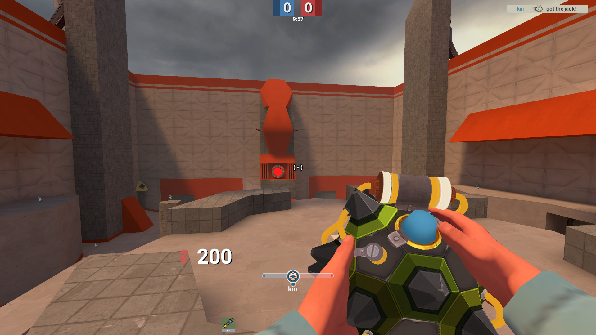
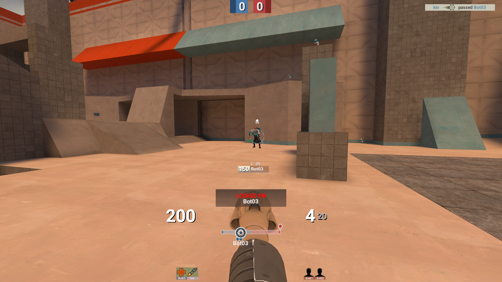
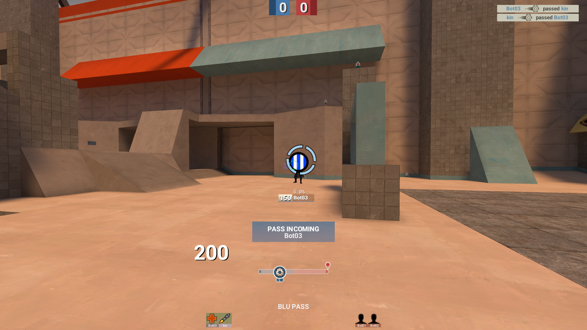

# KinHUD 2025 - Made for PASS Time

## SETUP
The buttons on the main menu will load up maps and execute a practice config (included with the HUD).
Please check the `cfg` folder and look at `pt.cfg` - it contains some binds that you may want to change.

To make the buttons work, you need to add this line to your autoexec:
`exec kinhudmaps`

## MINMODE IS BROKEN

### Screenshots

